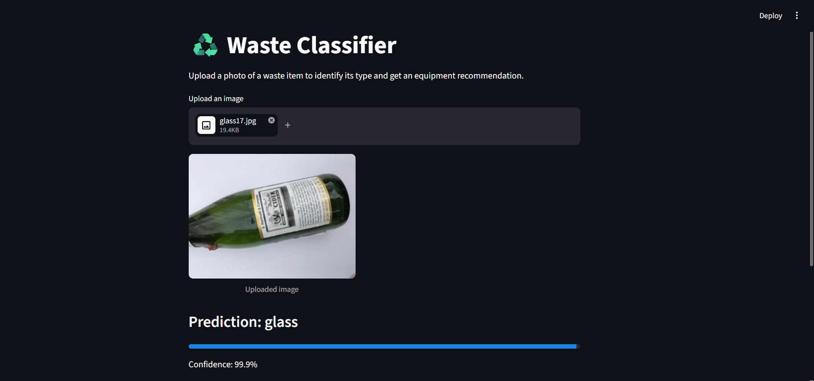
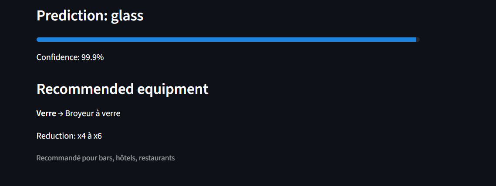

# Waste Classifier

Photo-based waste identification tool with equipment recommendations.

Upload a photo of a waste item → get its type + recommended machine
+ expected volume reduction.

## Stack
- **fastai** (ResNet34, transfer learning) — image classification
- **FastAPI** — `/predict` endpoint
- **Streamlit** — demo dashboard

## Project structure
```
waste-classifier/
├── data/                  # training images, one folder per class
├── model/
│   └── waste_classifier.pkl
├── train.py               # trains and exports the model
├── app.py                 # FastAPI backend
├── dashboard.py           # Streamlit demo UI
├── recommendations.py     # class ->  equipment mapping
└── requirements.txt
```

## Setup
```bash
pip install -r requirements.txt
```

## 1. Get the dataset
Download the Kaggle "Garbage Classification" dataset:
https://www.kaggle.com/datasets/asdasdasasdas/garbage-classification

Unzip it into `data/` so you have:
```
data/cardboard/  data/glass/  data/metal/  data/paper/  data/plastic/  data/trash/
```

## 2. Train
```bash
python train.py
```
Saves `model/waste_classifier.pkl`. Takes a few minutes on CPU for 4 epochs.

## 3. Run the API
```bash
uvicorn app:app --reload
```
Test it:
```bash
curl -X POST -F "file=@sample.jpg" http://127.0.0.1:8000/predict
```

## 4. Run the dashboard
```bash
streamlit run dashboard.py
```
## Demo UI




### Prediction result


